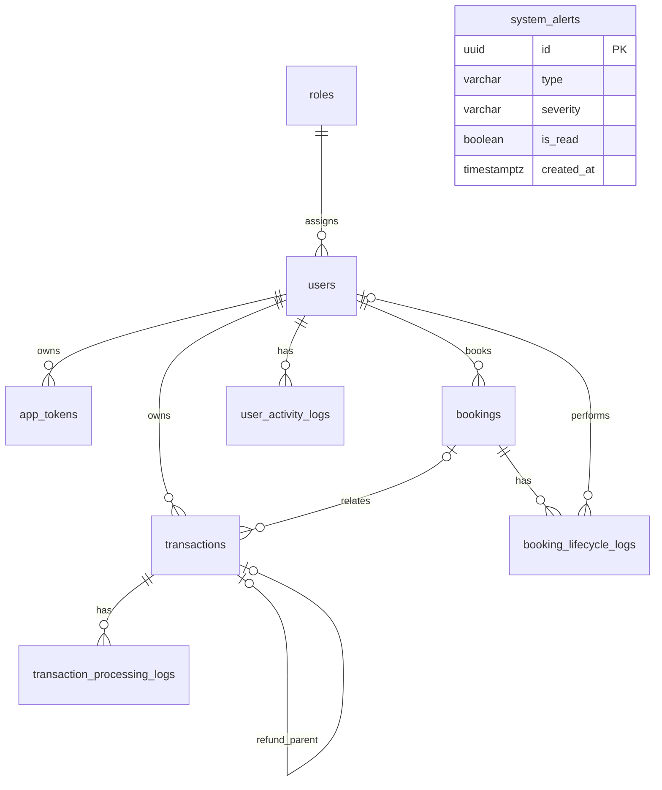

# PostgreSQL schema

The migrations are the source of truth. This reference follows the current TypeORM entities; database column names are shown below.

## Relationships



## app_tokens

| Column | Type | Nullable | Notes |
| --- | --- | --- | --- |
| `id` | uuid | No | Primary key; Generated UUID |
| `createdAt` | timestamptz | No | Default: now() |
| `updatedAt` | timestamptz | No | Default: now() |
| `user_id` | uuid | No |  |
| `access_token` | text | No | Excluded from ordinary selects |
| `refresh_token` | text | No | Excluded from ordinary selects |
| `device_token` | text | Yes | Excluded from ordinary selects |
| `ip_address` | inet | Yes |  |
| `is_expired` | boolean | No | Default: false |

Foreign keys:

- `user_id` → `users.id`; delete rule: CASCADE.

Indexes and uniqueness:

- `IDX_app_tokens_user_id_is_expired`: `user_id`, `is_expired`.

## booking_lifecycle_logs

| Column | Type | Nullable | Notes |
| --- | --- | --- | --- |
| `id` | uuid | No | Primary key; Generated UUID |
| `created_at` | timestamptz | No | Default: now() |
| `booking_id` | uuid | No |  |
| `event_type` | varchar(50) | No |  |
| `title` | varchar(255) | No |  |
| `description` | text | Yes |  |
| `performed_by` | uuid | Yes |  |
| `metadata` | jsonb | Yes |  |

Foreign keys:

- `booking_id` → `bookings.id`; delete rule: RESTRICT.
- `performed_by` → `users.id`; delete rule: RESTRICT.

Indexes and uniqueness:

- `IDX_booking_lifecycle_logs_recent`: `booking_id`, `created_at`.

## bookings

| Column | Type | Nullable | Notes |
| --- | --- | --- | --- |
| `id` | uuid | No | Primary key; Generated UUID |
| `createdAt` | timestamptz | No | Default: now() |
| `updatedAt` | timestamptz | No | Default: now() |
| `booking_code` | varchar(50) | No |  |
| `user_id` | uuid | No |  |
| `service_name` | varchar(150) | No |  |
| `schedule_at` | timestamptz | No |  |
| `duration_minutes` | integer | No |  |
| `location` | text | Yes |  |
| `special_notes` | text | Yes |  |
| `amount` | numeric(12,2) | No |  |
| `status` | enum | No | Values: `pending`, `confirmed`, `completed`, `cancelled`; Default: pending |
| `is_delete` | boolean | No | Default: false |

Foreign keys:

- `user_id` → `users.id`; delete rule: RESTRICT.

Indexes and uniqueness:

- `IDX_bookings_user_id`: `user_id`.
- `IDX_bookings_schedule_at`: `schedule_at`.
- `IDX_bookings_status_schedule_at`: `status`, `schedule_at`.
- Unique: `booking_code`.

Checks:

```sql
"amount" >= 0
```

```sql
"duration_minutes" > 0
```


## roles

| Column | Type | Nullable | Notes |
| --- | --- | --- | --- |
| `id` | uuid | No | Primary key; Generated UUID |
| `createdAt` | timestamptz | No | Default: now() |
| `updatedAt` | timestamptz | No | Default: now() |
| `role_code` | varchar(50) | No |  |
| `name` | varchar(100) | No |  |
| `description` | text | Yes |  |
| `is_delete` | boolean | No | Default: false |

Indexes and uniqueness:

- Unique: `role_code`.

## system_alerts

| Column | Type | Nullable | Notes |
| --- | --- | --- | --- |
| `id` | uuid | No | Primary key; Generated UUID |
| `created_at` | timestamptz | No | Default: now() |
| `type` | varchar(30) | No |  |
| `title` | varchar(255) | No |  |
| `description` | text | Yes |  |
| `severity` | varchar(20) | No |  |
| `metadata` | jsonb | Yes |  |
| `is_read` | boolean | No | Default: false |
| `expires_at` | timestamptz | Yes |  |

Indexes and uniqueness:

- `IDX_system_alerts_recent`: `is_read`, `created_at`.

## transaction_processing_logs

| Column | Type | Nullable | Notes |
| --- | --- | --- | --- |
| `id` | uuid | No | Primary key; Generated UUID |
| `created_at` | timestamptz | No | Default: now() |
| `transaction_id` | uuid | No |  |
| `status` | varchar(50) | No |  |
| `title` | varchar(255) | No |  |
| `description` | text | Yes |  |
| `metadata` | jsonb | Yes |  |

Foreign keys:

- `transaction_id` → `transactions.id`; delete rule: RESTRICT.

Indexes and uniqueness:

- `IDX_transaction_processing_logs_recent`: `transaction_id`, `created_at`.

## transactions

| Column | Type | Nullable | Notes |
| --- | --- | --- | --- |
| `id` | uuid | No | Primary key; Generated UUID |
| `createdAt` | timestamptz | No | Default: now() |
| `updatedAt` | timestamptz | No | Default: now() |
| `transaction_code` | varchar(50) | No |  |
| `user_id` | uuid | No |  |
| `booking_id` | uuid | Yes |  |
| `parent_transaction_id` | uuid | Yes |  |
| `transaction_type` | enum | No | Values: `payment`, `refund`, `transfer` |
| `status` | enum | No | Values: `pending`, `processing`, `completed`, `failed`, `refunded`; Default: pending |
| `subtotal` | numeric(12,2) | No |  |
| `total_amount` | numeric(12,2) | No |  |
| `currency` | varchar(3) | Yes |  |
| `payment_gateway` | varchar(100) | Yes |  |
| `gateway_reference` | varchar(255) | Yes |  |
| `gateway_fee` | numeric(12,2) | No | Default: 0 |
| `invoice_number` | varchar(100) | Yes |  |
| `invoice_url` | text | Yes |  |
| `is_delete` | boolean | No | Default: false |
| `proceed_at` | timestamptz | Yes |  |

Foreign keys:

- `user_id` → `users.id`; delete rule: RESTRICT.
- `booking_id` → `bookings.id`; delete rule: RESTRICT.
- `parent_transaction_id` → `transactions.id`; delete rule: RESTRICT.

Indexes and uniqueness:

- `IDX_transactions_user_id`: `user_id`.
- `IDX_transactions_booking_id`: `booking_id`.
- `IDX_transactions_parent_transaction_id`: `parent_transaction_id` (unique).
- `IDX_transactions_status_created_at`: `status`, `createdAt`.
- Unique: `transaction_code`.

Checks:

```sql
"gateway_fee" >= 0 AND (("subtotal" >= 0 AND "total_amount" >= 0 AND "parent_transaction_id" IS NULL) OR ("transaction_type" = 'refund' AND "parent_transaction_id" IS NOT NULL AND "subtotal" < 0 AND "total_amount" < 0))
```


## user_activity_logs

| Column | Type | Nullable | Notes |
| --- | --- | --- | --- |
| `id` | uuid | No | Primary key; Generated UUID |
| `created_at` | timestamptz | No | Default: now() |
| `user_id` | uuid | No |  |
| `action` | varchar(100) | No |  |
| `title` | varchar(255) | No |  |
| `description` | text | Yes |  |
| `entity_type` | varchar(50) | Yes |  |
| `entity_id` | uuid | Yes |  |
| `metadata` | jsonb | Yes |  |
| `ip_address` | inet | Yes |  |
| `user_agent` | text | Yes |  |

Foreign keys:

- `user_id` → `users.id`; delete rule: RESTRICT.

Indexes and uniqueness:

- `IDX_user_activity_logs_recent`: `user_id`, `created_at`.

## users

| Column | Type | Nullable | Notes |
| --- | --- | --- | --- |
| `id` | uuid | No | Primary key; Generated UUID |
| `createdAt` | timestamptz | No | Default: now() |
| `updatedAt` | timestamptz | No | Default: now() |
| `role_id` | uuid | No |  |
| `user_code` | varchar(50) | No |  |
| `name` | varchar(150) | No |  |
| `email` | varchar(254) | No |  |
| `phone_number` | varchar(30) | Yes |  |
| `dob` | date | Yes |  |
| `password` | varchar(255) | No | Excluded from ordinary selects |
| `avatar_url` | text | Yes |  |
| `address` | text | Yes |  |
| `city` | varchar(100) | Yes |  |
| `state` | varchar(100) | Yes |  |
| `country` | varchar(100) | Yes |  |
| `status` | enum | No | Values: `active`, `suspended`, `inactive`; Default: active |
| `is_delete` | boolean | No | Default: false |
| `last_active_at` | timestamptz | Yes |  |

Foreign keys:

- `role_id` → `roles.id`; delete rule: RESTRICT.

Indexes and uniqueness:

- `IDX_users_role_id`: `role_id`.
- `IDX_users_name`: `name`.
- `IDX_users_status_is_delete`: `status`, `is_delete`.
- Unique: `user_code`.
- Unique: `email`.

## Storage conventions

Core tables use `createdAt` and `updatedAt` inherited from CustomBaseEntity. Log tables use `created_at` and have no update timestamp. Entity properties use camelCase; explicit mappings preserve the supplied snake_case database columns.

Money is numeric(12,2); API amounts normally remain strings. Dashboard aggregates return numbers. Booking location and transaction currency are nullable until decided later.

Roles, users, bookings and transactions have unique display codes from `role_code_seq`, `user_code_seq`, `booking_code_seq` and `transaction_code_seq`. Sequences can have gaps after a rollback.

`parent_transaction_id` links a refund to its original transaction. Its unique index permits one linked full refund per original. Negative amounts are allowed for linked refunds; existing unlinked positive refund records remain valid. A foreign key cannot validate polymorphic `user_activity_logs.entity_id`; its meaning depends on `entity_type`.

Soft deletion uses `is_delete`; it does not remove dependent records. Logs and alerts have no soft-delete column. The TypeORM migration-history table is framework bookkeeping and is omitted from the diagram.
